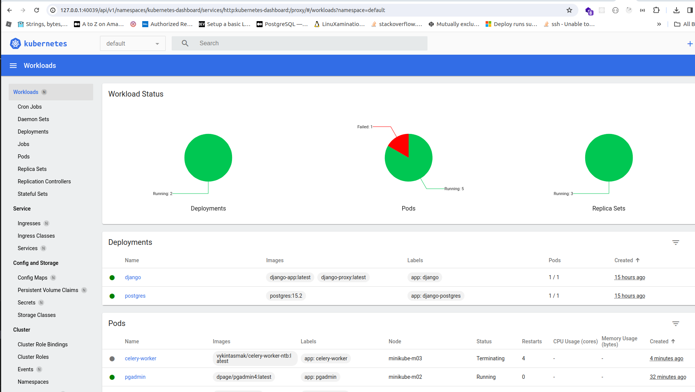

### Development
 #### venv

 1. cd to project folder then run ```python3.11 -m venv .```
 2. activate the environment ```source bin/activate```
 3. install requirements ``` pip install -r requirements.txt```
 4. run the project ``` python manage.py runserver```
 5. access your project in browser -> localhost:8000


 ### docker

#### docker compose
1. start the app ```docker-compose up```
2. rebuild the image ````docker-compose up --build```
3. access your project in browser -> localhost:8000

### kubernetes

1. start nodes ```minikube start --nodes 3 ```
2. customization files(deploy folder) ```kubectl apply -k deploy/ ```
3. If you stuck in ```verifying proxy health```, stop minikube, run ```export NO_PROXY=localhost,127.0.0.1,10.96.0.0/12,192.168.59.0/24,192.168.49.0/24,192.168.39.0/24```. Delete minikube cluster ``` minikube delete --all`` and run again  step 1 to step 3
4. start the minikube dashboard ``` minikube dashboard ```


### commands

1. ```kubectl get deployments```
2. ``` kubectl get pods```


### django app
1. build the app ```docker build -t django-app:latest .```
    or ```docker buildx build -t django-app:latest```
2. build the proxy ```docker build -t django-proxy:latest proxy/```

### load the images to minikube
1. ``` minikube image load django-app:latest```
2. ```minikube image load django-proxy:latest```

### get services
1. ``` kubectl get service```

### create a tunnel for django app
1. ```minikube service django```


### troubleshooting
if after running minikube service django doesnt work like 400 error do this

1. ```kubectl get services```
2. ```kubectl port-forward service/django 7080:8000```
3. now access your django app localhost:7080


### create superuser
1. ```kubectl get pods```
2. ```kubectl exec -it <pod id> -c app -- python manage.py createsuperuser```


